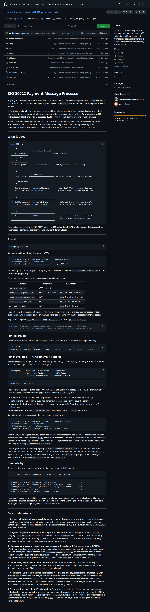

# ISO 20022 Payment Message Processor

A Spring Boot service that ingests, validates, transforms, settles, and acknowledges
**ISO 20022 `pacs.008`** (FI-to-FI Customer Credit Transfer) messages, responding with a
**`pacs.002`** (FI-to-FI Payment Status Report) on every request.

A `pacs.008` is a **batch**: it carries one or more credit-transfer transactions. Each one is
validated and settled independently and reported with its own status, so a single message can come
back **fully accepted (ACSC)**, **fully rejected (RJCT)**, or **partially accepted (PART)** — the
mix real clearing systems actually produce.

It models the kind of component that sits at the heart of a national payments or interbank
clearing system, with the correctness properties that matter when real money moves: idempotent
processing, atomic settlement, a balanced double-entry ledger, and structured ISO status
responses on every outcome.

<details>
<summary>📸 Rendered README preview</summary>



</details>

---

## What it does

```
  pacs.008 XML
       │
       ▼
 ┌─────────────────┐   FF01 (schema-invalid)
 │ 1. XSD validate │──────────────────────────► pacs.002 RJCT
 └─────────────────┘
       │ valid
       ▼
 ┌─────────────────┐
 │ 2. Parse (JAXB) │  → clean domain Payment (no XML types leak past this line)
 └─────────────────┘
       │
       ▼
 ┌─────────────────┐   already seen
 │ 3. Idempotency  │──────────────────────────► replay stored pacs.002 (no double-pay)
 └─────────────────┘
       │ first time
       ▼
 ┌─────────────────────────────────────────────┐
 │ 4. Per-transaction business validation       │   each CdtTrfTxInf judged on its own
 │    (loop over every CdtTrfTxInf)             │──► AM02 / AM03 / NARR per transaction
 └─────────────────────────────────────────────┘
       │
       ▼
 ┌─────────────────────────────────────────────┐
 │ 5. Settle accepted transfers (ONE txn)       │  → balanced double-entry per transfer;
 │    + record idempotency key, atomically      │    whole batch commits or rolls back
 └─────────────────────────────────────────────┘
       │
       ▼
 ┌─────────────────────────────────────────────┐
 │ 6. Generate pacs.002 (XSLT)                  │  → per-transaction TxSts + a derived
 │                                              │    group status: ACSC / PART / RJCT
 └─────────────────────────────────────────────┘
```

The pipeline exercises the full ISO 20022 toolchain: **XSD validation, XSLT transformation,
XML processing, the message standards themselves, and payment-domain logic.**

---

## Run it

```bash
mvn spring-boot:run
```

Submit the valid sample (settles, returns ACSC):

```bash
curl -s -X POST http://localhost:8080/api/v1/payments/pacs008 \
  -H "Content-Type: application/xml" \
  --data-binary @src/main/resources/samples/valid-pacs008.xml
```

Submit it **again** — same `MsgId` — and you get the *identical* response with
`X-Idempotent-Replay: true` and **no second ledger posting**.

Other samples that exercise the rejection and partial-batch paths:

| Sample | Outcome | ISO reason |
|---|---|---|
| `valid-pacs008.xml` | ACSC (settled) | — |
| `partial-batch-pacs008.xml` | **PART** — 2 of 3 settle | `AM02` on the rejected leg |
| `invalid-amount-pacs008.xml` | RJCT | `AM02` Not allowed amount |
| `same-party-pacs008.xml` | RJCT | `NARR` Debtor = Creditor |
| any malformed XML | RJCT | `FF01` Invalid file format |

The partial batch is the interesting one — the returned `pacs.002` carries a `TxSts` per
transaction (`ACSC`, `RJCT`, `ACSC`) under a group status of `PART`, and the ledger shows only the
two accepted transfers posted.

Inspect the ledger at `http://localhost:8080/h2-console` (JDBC URL `jdbc:h2:mem:ledger`).

```bash
mvn test   # 16 tests: business rules, the double-entry invariant, full HTTP flow,
           # partial-batch settlement, idempotency under concurrency, and an XXE attack
```

### Run it in Docker

The standalone image runs the default `local` profile (in-memory H2 — zero external dependencies):

```bash
docker build -t iso20022-processor .
docker run -p 8080:8080 iso20022-processor   # runs as a non-root user, with a healthcheck
```

### Run the full stack — Kong gateway + Postgres

`docker compose up` brings up the production-shaped topology: a counterparty talks **only** to Kong,
which fronts the settlement engine, which persists to Postgres.

```
counterparty ──▶ kong :8000 ──▶ app :8080 ──▶ postgres :5432
                 (authn, rate-limit,         (durable ledger +
                  size cap, correlation)      idempotency store)
```

```bash
docker compose up --build
```

The app is **not** published to the host — the settlement engine is never directly reachable. The
only way in is Kong on `:8000`, which enforces edge policy declaratively (`kong/kong.yml`):

- **key-auth** — every submission must present a counterparty API key (no anonymous clearing).
- **rate-limiting** — 60 req/min, budgeted *per consumer* so one bank can't starve the others.
- **request-size-limiting** — 512 KB body cap, rejected at the edge (defense in depth with the
  app's XXE hardening).
- **correlation-id** — stamps `X-Correlation-ID`, pairing with the app's `MsgId` MDC trace.

Submit through the gateway with the demo counterparty's key:

```bash
curl -s -X POST http://localhost:8000/api/v1/payments/pacs008 \
  -H "Content-Type: application/xml" \
  -H "apikey: demo-bank-key-please-rotate" \
  --data-binary @src/main/resources/samples/valid-pacs008.xml
```

Omit the key and Kong returns `401` before the request ever reaches the app. Because Postgres uses a
named volume, the ledger and answered-`MsgId` set **survive a restart** — bounce the stack and a
redelivered pacs.008 still replays its stored response instead of paying twice. Edge metrics
(per-consumer status codes, latency, rate-limit hits) are at `http://localhost:8100/metrics`.

The Postgres schema is owned by **Flyway** (`src/main/resources/db/migration`), not Hibernate: the
unique constraint that makes idempotency correct lives in version-controlled DDL, and Hibernate runs
`validate`-only against it (failing fast on any drift between the migration and the `@Entity`
mappings). Inspect the ledger directly on the host at `localhost:5433` (db/user/pass `payments`).

### Observability

Business outcomes — not just request counts — are exported via Micrometer:

```bash
curl -s http://localhost:8080/actuator/prometheus | grep iso20022
```

```
iso20022_batches_processed_total{groupStatus="PART"}                     1.0
iso20022_transactions_processed_total{status="ACSC",reason="NONE"}       2.0
iso20022_transactions_processed_total{status="RJCT",reason="AM02"}       1.0
iso20022_batches_replayed_total                                          1.0
iso20022_settlement_duration_seconds{quantile="0.95"}                  ...
```

The accept/reject mix, which ISO reason codes are firing, the duplicate-replay rate, and
settlement latency are exactly the signals an operator watches on a clearing component. Every log
line for a message also carries its `MsgId` (via MDC) so a single payment is traceable end to end.

---

## Design decisions

**1. Schema validation and business validation are separate layers — on purpose.**
A schema-valid message can still be a financially invalid instruction (a perfectly well-formed
message instructing a negative transfer). Conflating "well-formed" with "acceptable" is a
classic payments bug. XSD is the syntax gate; `PaymentValidator` is the semantics gate.

**2. A rejected payment is a *successful* exchange, not an HTTP error.**
Business rejections return `200 OK` carrying a `pacs.002 RJCT` with an ISO reason code — never a
`4xx/5xx` with a stack trace. The counterparty's reconciliation depends on receiving a
structured status. We fail *with a document*, not *with an exception*. Only a genuine internal
fault (e.g. a ledger invariant breach) becomes a 5xx.

**3. Idempotency is keyed on `MsgId`, and the database is the real guard.**
Payment transports (IBM MQ, SWIFT, real-time clearing) are at-least-once — duplicates are
*expected*, not exceptional. The in-memory check is an optimisation; the **unique constraint**
on `processed_message.message_id` is what makes it correct under concurrency. If two duplicate
deliveries race, one loses on the constraint and we return the winner's stored response rather
than paying twice. Without this, a redelivered `pacs.008` = a double payment.

**4. Double-entry ledger with an enforced zero-sum invariant.**
Every settled transfer writes exactly two postings — a debit and a credit — that must net to zero,
checked *before* commit. Money systems fail closed: if the books would go out of balance, the
transaction rolls back.

**5. A batch is the unit of atomicity and idempotency — but the unit of *judgment* is the transaction.**
Each `CdtTrfTxInf` is validated on its own, so one bad transaction does not sink its siblings: the
batch comes back `PART` with a per-transaction `TxSts`. But settlement of every accepted transfer
*plus* recording the `MsgId` happens in **one** transaction — so a redelivered batch can never
re-post *any* of its legs, and a mid-batch failure rolls the whole thing back. Per-transaction
verdicts, all-or-nothing commit.

**6. The Java side decides; the XSLT only renders.**
Per-transaction verdicts can't be expressed as one group-wide stylesheet parameter, so the
processor computes every transaction's status in Java and hands the XSLT a small verdict node-set
(resolved in-process via the `document()` function — never fetched). The stylesheet looks each
transaction up by `TxId` and renders its `TxSts`. The transform stays a pure renderer; the verdict
logic stays testable Java.

**7. Compile-once / use-per-call for all XML engines.**
`Schema`, `JAXBContext`, and XSLT `Templates` are immutable, thread-safe, and expensive — built
once at startup. `Validator`, `Unmarshaller`, and `Transformer` are stateful and **not**
thread-safe — created per call. Getting this split wrong is a real production footgun: either
you pay the compile cost on every request, or you corrupt state under load.

**8. XXE hardening on every parser — and a test that proves it.**
Payment ingress is untrusted input. DOCTYPE declarations and external entities are disabled on
the schema factory, the StAX reader, and the transformer factory. `XxeHardeningTest` fires a real
external-entity payload at a local secret and asserts it is rejected and never expands — XML-based
payment rails are a textbook XXE target.

**9. JAXB model is decoupled from the domain.**
XML/JAXB types stop at `Pacs008Parser`. Everything downstream works with the plain `CreditTransfer`
/ `PaymentBatch` records, so the ledger and validation never depend on the wire format. Swapping
`pacs.008.001.08` for a newer version touches the binding layer only.

---

## Production hardening

Running this in a real clearing context would add:

- **Official ISO 20022 schemas.** The bundled `pacs.008.001.08.xsd` is a faithful, valid
  *subset* so the project runs out of the box. Drop the official schema from
  [iso20022.org](https://www.iso20022.org/iso-20022-message-definitions) into
  `src/main/resources/schema/` and the validation gate uses it unchanged.
- **IBM MQ ingress** instead of (or alongside) the HTTP endpoint — a JMS listener with a
  dead-letter queue, poison-message handling, and the same idempotent consumer logic. (This is
  the companion "IBM MQ Integration Gateway" project.)
- **Real account/balance checks** — `AC04` closed account, insufficient-funds, limit checks.
- **Idempotency-store retention policy** — the durable Postgres `processed_message` table grows
  unbounded; a real deployment ages out or archives answered `MsgId`s on a settlement-window TTL.
- **Distributed tracing** — the metrics and MDC correlation are wired here; OpenTelemetry spans
  per message across the MQ → settle → acknowledge hops are the next step.

Already implemented: **multi-transaction batches with
per-transaction status**, **partial-batch settlement**, a **durable Postgres ledger +
idempotency store** (Flyway-managed, idempotency enforced by a DB unique constraint), an
**API-gateway edge** (Kong: key-auth, per-consumer rate limiting, size cap, correlation IDs),
**Prometheus metrics**, **CI**, and a **non-root container**.

---

## Stack

Java 21 · Spring Boot 3.3 · Spring Data JPA · JAXB (jakarta) · JAXP (XSD + XSLT) ·
Micrometer / Prometheus · H2 / Postgres · Flyway · Kong API gateway ·
JUnit 5 + MockMvc · Docker / Docker Compose · GitHub Actions
