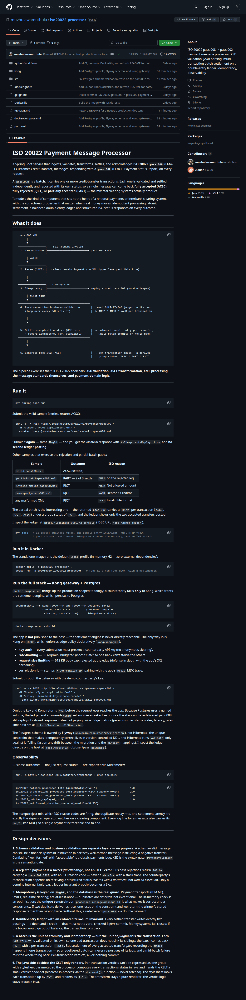

# ISO 20022 Payment Message Processor

Spring Boot service that ingests **ISO 20022 `pacs.008`** (FI-to-FI Customer Credit Transfer)
batches and always responds with a **`pacs.002`** (FI-to-FI Payment Status Report).

A `pacs.008` is a **batch**: one or more credit-transfer transactions. Each is validated and
settled independently, so a single message can return **fully accepted (`ACSC`)**, **fully
rejected (`RJCT`)**, or **partially accepted (`PART`)** — the mix real clearing systems produce.

Built for the correctness properties that matter when money moves: idempotent processing, atomic
settlement, a balanced double-entry ledger, and structured ISO status on every outcome.



## Documentation

| Doc | Contents |
|---|---|
| [Getting started](docs/getting-started.md) | Local run, samples, Docker, Kong + Postgres stack, tests |
| [Architecture](docs/architecture.md) | Pipeline, packages, transactional boundary, data model, edge |

## Pipeline

```
  pacs.008 XML
       │
       ▼
 ┌─────────────────┐   FF01 (schema-invalid)
 │ 1. XSD validate │──────────────────────────► pacs.002 RJCT
 └─────────────────┘
       │ valid
       ▼
 ┌─────────────────┐
 │ 2. Parse (JAXB) │  → domain PaymentBatch (XML types stop here)
 └─────────────────┘
       │
       ▼
 ┌─────────────────┐   already seen
 │ 3. Idempotency  │──────────────────────────► replay stored pacs.002
 └─────────────────┘
       │ first time
       ▼
 ┌─────────────────────────────────────────────┐
 │ 4. Per-transaction business validation       │  AM02 / AM03 / NARR per CdtTrfTxInf
 └─────────────────────────────────────────────┘
       │
       ▼
 ┌─────────────────────────────────────────────┐
 │ 5. Settle accepted transfers (ONE DB txn)    │  double-entry + MsgId record, atomic
 └─────────────────────────────────────────────┘
       │
       ▼
 ┌─────────────────────────────────────────────┐
 │ 6. Generate pacs.002 (XSLT)                  │  TxSts per txn; group ACSC / PART / RJCT
 └─────────────────────────────────────────────┘
```

## Quick start

```bash
mvn spring-boot:run
```

```bash
curl -s -X POST http://localhost:8080/api/v1/payments/pacs008 \
  -H "Content-Type: application/xml" \
  --data-binary @src/main/resources/samples/valid-pacs008.xml
```

Submit the same payload again (same `MsgId`): identical `pacs.002`, header
`X-Idempotent-Replay: true`, and **no second ledger posting**.

| Sample | Outcome | ISO reason |
|---|---|---|
| `valid-pacs008.xml` | ACSC | — |
| `partial-batch-pacs008.xml` | PART (2 of 3 settle) | `AM02` on the rejected leg |
| `invalid-amount-pacs008.xml` | RJCT | `AM02` |
| `same-party-pacs008.xml` | RJCT | `NARR` |
| malformed XML | RJCT | `FF01` |

Full runbook (Docker, Kong gateway, Postgres, metrics, H2 console): **[Getting started](docs/getting-started.md)**.

```bash
mvn test   # business rules, double-entry invariant, HTTP flow, partial batch,
           # concurrent idempotency, XXE hardening
```

## Design decisions

**1. Schema validation and business validation are separate layers.**
A schema-valid message can still be financially invalid. XSD is the syntax gate;
`PaymentValidator` is the semantics gate.

**2. A rejected payment is a successful exchange, not an HTTP error.**
Business rejections return `200 OK` with a `pacs.002 RJCT` and an ISO reason code. Only genuine
internal faults become 5xx. Response headers: `X-Payment-Status`, `X-Idempotent-Replay`.

**3. Idempotency is keyed on `MsgId`; the database is the real guard.**
Payment transports are at-least-once. The unique constraint on `processed_message.message_id`
wins under concurrency: the loser rolls back and the winner’s stored `pacs.002` is replayed.

**4. Double-entry ledger with an enforced zero-sum invariant.**
Each settled transfer posts a debit and a credit that must net to zero before commit.

**5. Batch atomicity; per-transaction judgment.**
Each `CdtTrfTxInf` is validated alone (so siblings can settle under `PART`), but settlement of
every accepted transfer **plus** recording the `MsgId` is one database transaction.

**6. Java decides; XSLT only renders.**
Per-transaction verdicts are computed in Java and passed into the stylesheet as a small node-set
(via in-process `document()`). The transform stays a pure renderer.

**7. Compile-once / use-per-call for XML engines.**
`Schema`, `JAXBContext`, and XSLT `Templates` are built once at startup. `Validator`,
`Unmarshaller`, and `Transformer` are created per call (not thread-safe).

**8. XXE hardening on every parser — with a test that proves it.**
DOCTYPE and external entities are disabled on the schema factory, StAX reader, and transformer
factory. `XxeHardeningTest` asserts rejection of a real external-entity payload.

**9. JAXB model is decoupled from the domain.**
XML types stop at `Pacs008Parser`. Downstream code uses `CreditTransfer` / `PaymentBatch` only.

## Production hardening

Already in this repo: multi-transaction batches with per-transaction status, partial-batch
settlement, durable Postgres ledger + idempotency store (Flyway; Hibernate `validate`-only),
Kong edge (key-auth, per-consumer rate limit, size cap, correlation IDs), Prometheus metrics,
CI, and a non-root container.

A real clearing deployment would still add:

- Official ISO 20022 schemas from [iso20022.org](https://www.iso20022.org/iso-20022-message-definitions)
  (the bundled `pacs.008.001.08.xsd` is a faithful subset so the project runs out of the box)
- IBM MQ / JMS ingress with DLQ and poison-message handling
- Real account/balance checks (`AC04`, insufficient funds, limits)
- Idempotency-store retention / archival on a settlement-window TTL
- Distributed tracing (OpenTelemetry) across MQ → settle → acknowledge

## Stack

Java 21 · Spring Boot 3.3 · Spring Data JPA · JAXB (jakarta) · JAXP (XSD + XSLT) ·
Micrometer / Prometheus · H2 / Postgres · Flyway · Kong API gateway ·
JUnit 5 + MockMvc · Docker / Docker Compose · GitHub Actions
